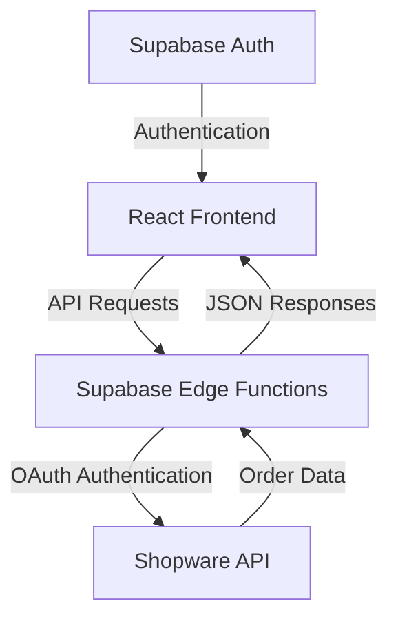

# Kiezbett Toolbox Project Description

## Overview

The Kiezbett Toolbox is a web application designed to manage and process orders from a Shopware e-commerce system. It provides an interface for viewing, tracking, and updating order statuses through various stages of the fulfillment process. The application is built with modern web technologies and follows a client-server architecture with a clear separation of concerns.

## Technical Stack

### Frontend
- **Framework**: React 18 with TypeScript
- **Build Tool**: Vite
- **State Management**: Zustand for global state, React Query for server state
- **UI Components**: Custom components built with Radix UI primitives
- **Styling**: Tailwind CSS with class-variance-authority for component variants
- **Routing**: React Router DOM

### Backend
- **Platform**: Supabase Edge Functions (Deno runtime)
- **Authentication**: Supabase Auth
- **API Integration**: Shopware API via OAuth authentication

## Architecture

The application follows a modern web architecture with:

1. **Frontend SPA**: Single-page application built with React
2. **API Layer**: Supabase Edge Functions serving as a middleware
3. **External Service**: Shopware e-commerce platform as the data source



## Key Components

### Authentication System

The application uses Supabase for authentication. The authentication flow is managed through the `auth.api.ts` file, which:

- Creates a Supabase client with the project URL and anonymous key
- Provides functions for user logout
- Generates authentication headers for API requests

```typescript
// Authentication configuration
const supabaseUrl = 'https://bxdlbbljmpersaoxvnnt.supabase.co';
const supabaseAnonKey = 'eyJhbGciOiJIUzI1NiIsInR5cCI6IkpXVCJ9...';
export const supabase = createClient(supabaseUrl, supabaseAnonKey);
```

### Order Management

The core functionality revolves around order management, implemented through:

1. **Order API Client** (`order.api.ts`):
   - Fetches orders with various filters
   - Retrieves individual order details
   - Updates order states, payment states, and delivery states

2. **Supabase Edge Functions** (`backend/supabase/functions/orders/index.ts`):
   - Acts as a middleware between the frontend and Shopware API
   - Handles routing for various order-related endpoints
   - Processes and transforms data between systems

3. **Shopware Integration** (`backend/supabase/functions/_shared/utils.ts`):
   - Manages OAuth token acquisition and caching
   - Provides authenticated access to the Shopware API

## Data Flow

### Order Retrieval Process

1. User requests orders from the frontend
2. Frontend calls the Supabase Edge Function endpoint
3. Edge Function authenticates with Shopware using OAuth
4. Edge Function queries Shopware API with appropriate filters
5. Data is transformed and returned to the frontend
6. Frontend displays the orders with React Query managing cache and state

### Order State Updates

The application supports updating various aspects of an order:

1. **Order State**: Overall status of the order (open, in progress, completed, cancelled)
2. **Payment State**: Status of payment processing
3. **Delivery State**: Status of shipping and delivery

Each state change follows a similar pattern:
- Frontend sends state transition request
- Edge Function authenticates with Shopware
- State machine transition is requested via Shopware API
- Result is returned to the frontend

## Frontend Structure

### Component Organization

The frontend is organized into:

1. **Pages**: Main views like dashboard, orders, login, and settings
2. **Components**: Reusable UI elements
   - **UI Components**: Low-level UI primitives (buttons, inputs, etc.)
   - **Order Components**: Order-specific components (order rows, state dropdowns)
   - **Layout Components**: Structure elements (header, layout, sidebar)

### State Management

The application uses a hybrid approach to state management:

- **Zustand**: For global application state
- **React Query**: For server state (orders, transitions)
- **React Context**: For authentication state and protected routes

## Backend Structure

### Supabase Edge Functions

The backend logic is implemented as Supabase Edge Functions running on Deno:

1. **orders**: Main function handling order-related operations
   - GET /orders - List orders with filtering
   - GET /orders/:id - Get a specific order
   - GET /orders/:id/transitions - Get possible state transitions
   - POST /orders/:id/state - Update order state
   - POST /orders/:id/payment-state - Update payment state
   - POST /orders/:id/delivery-state - Update delivery state

2. **Shared Utilities**:
   - CORS handling
   - OAuth token management
   - Error handling

### Shopware Integration

The application integrates with Shopware through its REST API:

- **Authentication**: OAuth client credentials flow
- **Order Management**: State machine transitions for order processing
- **Data Retrieval**: Filtered and paginated order data with associations

## Environment Configuration

The application requires several environment variables:

1. **Shopware Configuration**:
   - `SHOPWARE_API_URL`: Base URL for the Shopware API
   - `SHOPWARE_OAUTH_URL`: OAuth token endpoint
   - `CLIENT_ID`: OAuth client ID
   - `CLIENT_SECRET`: OAuth client secret

2. **Supabase Configuration**:
   - Supabase URL and anonymous key (hardcoded in auth.api.ts)

> **Important Note**: This project does not host the Shopware API itself. It connects to an existing Shopware instance (appears to be at https://staging.kiezbett.com/api). The Supabase Edge Functions act as middleware between the frontend and the Shopware API.

## Development Workflow

The project uses:

- **Package Manager**: pnpm
- **TypeScript**: For type safety across the codebase
- **ESLint & Prettier**: For code quality and formatting
- **Vite**: For fast development and optimized builds

Development commands:
- `pnpm dev`: Start development server
- `pnpm build`: Build for production
- `pnpm lint`: Run linting
- `pnpm preview`: Preview production build
- `pnpm supabase:functions:deploy`: Deploy Supabase functions

## Path Aliases

The project uses path aliases configured in Vite for cleaner imports:

```typescript
// vite.config.ts
resolve: {
  alias: {
    "@": path.resolve(__dirname, "./src"),
    '@components': path.resolve(__dirname, "./src/components")
  },
}
```

This allows imports like:
```typescript
import { Component } from '@/components/component';
```
Instead of relative paths.

## Deployment Considerations

For deployment, the application requires:

1. **Frontend Hosting**: Any static hosting service (Vercel, Netlify, etc.)
2. **Supabase Project**: For Edge Functions and authentication
3. **Environment Variables**: Properly configured in both environments
4. **Shopware Access**: Valid credentials for the Shopware API

## Security Considerations

The application implements several security measures:

1. **Authentication**: Supabase authentication for user access
2. **API Security**: OAuth for secure Shopware API access
3. **Token Management**: Automatic token refresh and secure storage
4. **CORS Headers**: Properly configured for API requests

## Potential Improvements

Based on the codebase analysis, potential improvements could include:

1. **Environment Variable Management**: Move hardcoded values to environment variables
2. **Error Handling**: More comprehensive error handling and user feedback
3. **Caching Strategy**: Optimize React Query configuration for better performance
4. **Testing**: Add unit and integration tests
5. **Monitoring**: Add logging and monitoring for production use
